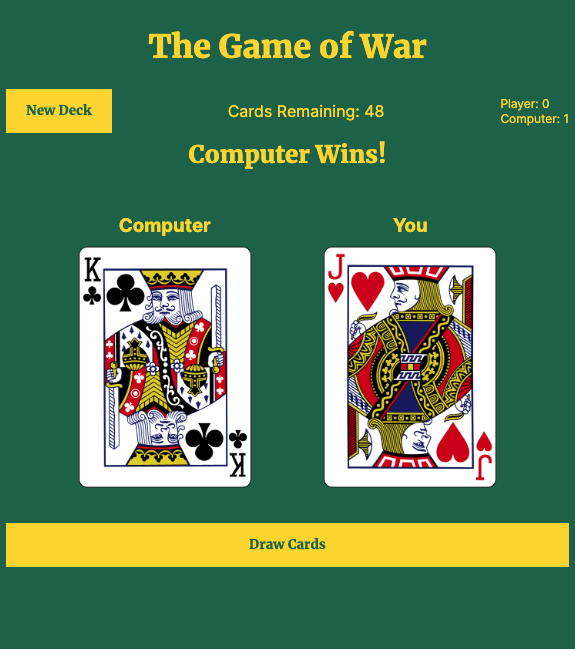

# The Game of War - A Card Game Using the Deck of Cards API
A simplified version of the classic card game war using the [Deck of Cards API](https://deckofcardsapi.com/)

## Table of contents

- [Overview](#overview)
  - [Screenshot](#screenshot)
  - [Links](#links)
- [My process](#my-process)
  - [Built with](#built-with)
  - [Useful resources](#useful-resources)
- [Author](#author)

## Overview

### Screenshot

### Links

- Live Site URL: [The Game of War](https://aeposten.github.io/card-war/)

### Built with

- Semantic HTML5 markup
- CSS custom properties
- Flexbox
- Mobile-first workflow

## Author

- Frontend Mentor - [@aeposten](https://www.frontendmentor.io/profile/aeposten)
- Linkedin - [Connect on Linkedin](https://www.linkedin.com/in/aeposten/)